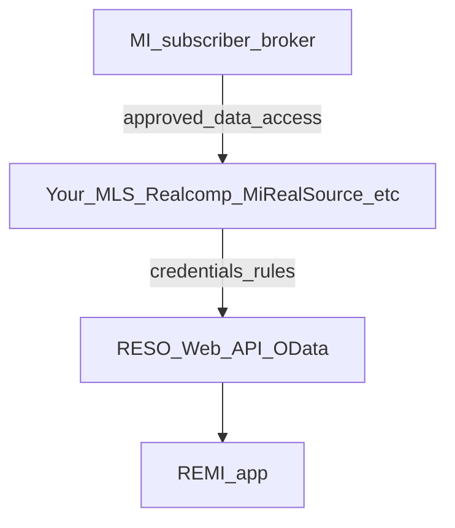
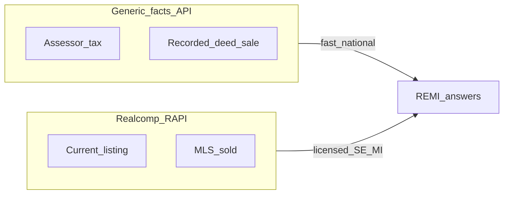

# Real estate data APIs — research summary

## Zillow

- The legacy **public Zillow API** is not a practical path for new products.
- **Bridge Interactive** ([bridgeinteractive.com](https://www.bridgeinteractive.com/developers/), [bridgedataoutput.com](https://bridgedataoutput.com)) is the official channel for **approved** Zillow Group / RESO **MLS and Zillow datasets** in many setups. Access is **application-based**, with **compliance** (attribution, display, often **no casual redistribution** of certain data—verify current terms).
- **Zillow / macro research** CSVs are separate from per-address Q&A.

## Realtor.com

- There is **no** general-purpose public API for arbitrary address lookups like a typical SaaS key.
- **Anywhere (Realogy) developer** programs ([developer.realogy.com](https://developer.realogy.com/explore-our-apis)) are **enterprise listing/marketing** oriented, not a drop-in “last sale at 410 Elm” API.
- [Realtor.com research data](https://www.realtor.com/research/data/) is **aggregated** market metrics, not per-address sale APIs.

## Answering “What did 410 Elm St. sell for last time?”

- **MLS path:** solds / listing history where your license and MLS rules allow—fields vary.
- **Public records path:** county recorder / tax data via **aggregators** (ATTOM, CoreLogic, Estated, etc.) or API-first vendors—**vendor contracts and county coverage** matter.

---

## Michigan MLS — do they have an API?

**Yes, in the sense the industry means “API” today:** most subscriber-facing MLSs deliver data via a **RESO Web API** (OData) or a certified equivalent, **not** an open public internet API.

**Important:** Michigan is **not** one MLS. Coverage is split across organizations (e.g. **Realcomp**, **MiRealSource**, and other regional boards). The **base URL, vendor (direct vs hosted), and rules** depend on **which MLS** you belong to.

### Realcomp (common in Southeast Michigan)

- **RAPI** — Realcomp’s **RESO Web API** (OData, RESO Data Dictionary, certified), replacing **RETS** for many consumers.
- **Access:** through **approved IDX / VOW / back-office** use, **in writing**; data compliance often via **[IDXSupport@realcomp.com](mailto:IDXSupport@realcomp.com)** (per Realcomp’s published API / IDX pages).
- **Product docs:** [Realcomp — Application Programming Interface (API)](https://www.realcomp.com/Products-Services/Services-Products/Application-Programming-Interface-API) and RAPI announcement materials on [realcomp.moveinmichigan.com](https://realcomp.moveinmichigan.com).

### MiRealSource and other MLSs

- Many Michigan MLSs use a **RESO Web API** exposed **directly** or via a **platform** (e.g. **Bridge** hosts RESO for some MLSs; third-party docs sometimes reference **Bridge** + selecting the MLS in their console after membership). **Get connection details from your MLS** after your broker-approved data access—do not assume Bridge vs direct without that confirmation.

### NAR / RESO expectation

- **NAR**-governed MLSs are expected to provide **production** **Web API** access under policy; **RESO** ([reso.org](https://www.reso.org/)) defines **standards**, not credentials—**your MLS** issues access under **subscriber/IDX** agreements.

### Practical takeaway for REMI

If you **already work from a Michigan MLS**, your **fastest technical path** is: **use that MLS’s documented Web API** (e.g. Realcomp **RAPI** where applicable) under your **existing subscriber/broker and IDX (or BBO/VOW) license**, not Zillow’s consumer site. Pair with **public records** only for gaps MLS policy does not cover, under separate vendor terms.

---

## Product scope: SE Michigan + Realcomp vs generic “fast facts” API

You are choosing between **(A)** a product that fits *you* and **Realcomp / Southeast Michigan** tightly, and **(B)** a product that leans on a **non-MLS, national** property-data API for quick structured facts. These are not mutually exclusive long-term; they differ in **v1 focus, risk, and moat**.

### Option A — Tailor to yourself: Realcomp + SE Michigan

| Upside                                                                                                                                                                | Downside                                                                                                                          |
| --------------------------------------------------------------------------------------------------------------------------------------------------------------------- | --------------------------------------------------------------------------------------------------------------------------------- |
| **Richest** context for your actual workflow: **active/pending/sold** as MLS allows, **days on market**, **agent-typed fields**, **status** aligned with how you work | **Compliance is real work**: IDX/VOW display rules, **attribution**, **refresh**, broker approval; not a weekend side integration |
| **Defensible** for a *your* product: you already understand **market boundaries** and **nuance** (e.g. what “comp” means locally)                                     | **Geography is a cage** for growth: other states/MLSs = new contracts, mapping, and testing                                       |
| **Best answers** to questions that depend on **current market** (listings, condition of market)                                                                       | **Slower to ship** if creds and legal sign-off are still pending                                                                  |

**When to pick A for v1:** REMI is primarily a **practitioner tool** for your market, and you are willing to treat **MLS compliance** as a first-class feature (not an afterthought).

### Option B — Non-MLS generic property API (“fast facts”)

Here “generic” means vendors that aggregate **assessor / tax / deed / AVM** style data (e.g. **public records** APIs—ATTOM, Estated, RealEstateAPI-style products, etc.—exact vendor TBD in RFI).

| Upside                                                                                    | Downside                                                                                                                                                              |
| ----------------------------------------------------------------------------------------- | --------------------------------------------------------------------------------------------------------------------------------------------------------------------- |
| **Faster to try**: often **self-serve keys**, **national** coverage in one model          | **Not the MLS layer**: can be **stale**, **missing** new builds/renos, or **wrong** on edge cases; **“last sale”** is recorder semantics, not always “last MLS close” |
| **Simpler** narrative for a **broad** user: “property facts” without showing MLS listings | Weaker on **“what’s on the market / what just sold this week”** without another source                                                                                |
| **Easier** to market outside Michigan                                                     | **Thinner moat**—anyone can wire the same API                                                                                                                         |

**When to pick B for v1:** You want **broad** geographic demos, or you want **something working before** Realcomp/IDX paperwork lands.

#### Option B — concrete API / vendor types to evaluate

No endorsement of a single vendor; **shortlist 2–3** and compare **(1)** address match quality in Wayne/Oakland/Macomb test addresses, **(2)** `sale` / `transfer` field semantics, **(3)** comps endpoints, **(4)** $/call and caps, **(5)** **redisplay** and **caching** in your terms of use.

| Path                                                    | Examples (verify current docs and pricing)                                                                                                                                                                                             | Notes                                                                                                                                                                                                                                                                                                               |
| ------------------------------------------------------- | -------------------------------------------------------------------------------------------------------------------------------------------------------------------------------------------------------------------------------------- | ------------------------------------------------------------------------------------------------------------------------------------------------------------------------------------------------------------------------------------------------------------------------------------------------------------------- |
| **Assessor + deed + AVM (classic “property data” API)** | [ATTOM developer platform](https://api.developer.attomdata.com/home) / [attomdata.com](https://www.attomdata.com/solutions/property-data-api/)                                                                                         | Broad U.S. coverage; REST **JSON/XML**; typical bundles: **detail, sales history, AVM**, sometimes risk/schools. **Estated** was acquired by ATTOM—prefer **ATTOM** for new work. Often **trial key**; enterprise tiers for volume.                                                                                 |
| **API-first property + (optional) add-on datasets**     | [RealEstateAPI developer docs](https://developer.realestateapi.com/)                                                                                                                                                                   | **Property detail**, **sale history** (recorder-oriented), **comps** endpoints, tax/mortgage-style fields; documents edge cases (e.g. `transactionType`, **non-disclosure** states with `$0` sale). Some products advertise **MLS-related** add-ons—treat as **separate** compliance from pure public-record facts. |
| **Listings on API marketplaces**                        | [RapidAPI](https://rapidapi.com/) and similar hubs                                                                                                                                                                                     | Many resellers reskin similar underlying data. **Vet the actual data owner**, SLAs, and **ToS**; good for **spikes** / experiments, not always the **stable** long-term path.                                                                                                                                       |
| **Enterprise / bulk**                                   | [ATTOM on AWS / Snowflake marketplaces](https://www.attomdata.com/) (if your architecture is warehouse-first)                                                                                                                          | For **batch** or **analytic** use; different tradeoffs than per-chat REST.                                                                                                                                                                                                                                          |
| **Larger data platforms** (usually **RFP**-driven)      | e.g. **CoreLogic** (various **property** and **AVM** products; **Trestle** is often **MLS-aggregated** [OData](https://trestle-documentation.corelogic.com/webapi.html)—**not** the same as a simple “one national public-record key”) | Strong when you need **scale**, **SSO/contract**, and **multiple** datasets; typically **slower** sales cycle than Option B v1.                                                                                                                                                                                     |

**Michigan-relevant check:** In **disclosure** markets, last sale **amounts** are often present on deed-derived feeds; still validate **“last”** = **warranty sale** vs **$0 transfer** (many APIs encode both).

### Option C — Hybrid (common in PropTech)

- **Ship v1** with a **generic facts** API for **enrichment** (bed/bath, tax, last recorded sale, owner where legal).
- **Add Realcomp (RAPI)** in v2 (or in parallel) for **market-accurate** SE MI context where your license allows.
- **Risks to manage:** **do not** mix MLS fields and vendor fields in the UI without **clear sourcing**; users trust wrong numbers when labels blur.

### Recommendation heuristic (for planning, not a mandate)

- If REMI’s **value** is *“agent-grade help in the market I trade in”* → bias **A** (or **C** with MLS on the roadmap).
- If REMI’s **value** is *“any U.S. address, quick context”* → bias **B**, and accept that **“comps” and market timing** answers stay **shallower** until an MLS or broker-grade feed exists.

**v1 data choice** is recorded in todo `product-scope` (generic property-facts first).

---

## Decision / open items

- **Your MLS: Realcomp** — primary integration is **RAPI** with compliance via Realcomp’s written IDX/data process (see [Realcomp API](https://www.realcomp.com/Products-Services/Services-Products/Application-Programming-Interface-API)); integration details for other Michigan MLSs differ.
- **Data compliance** for any chat display of MLS fields: **display rules, attribution, and refresh** are contract-driven.
- **Strategic fork:** see **“Product scope: SE Michigan + Realcomp vs generic ‘fast facts’ API”** above. **Current choice (v1): Option B** — lead with a **non-MLS property-facts** vendor for fast, broad coverage; **defer Realcomp RAPI** until you want **market-timely, MLS-licensed** answers (or run **mls-creds** in parallel if paperwork is already moving).

