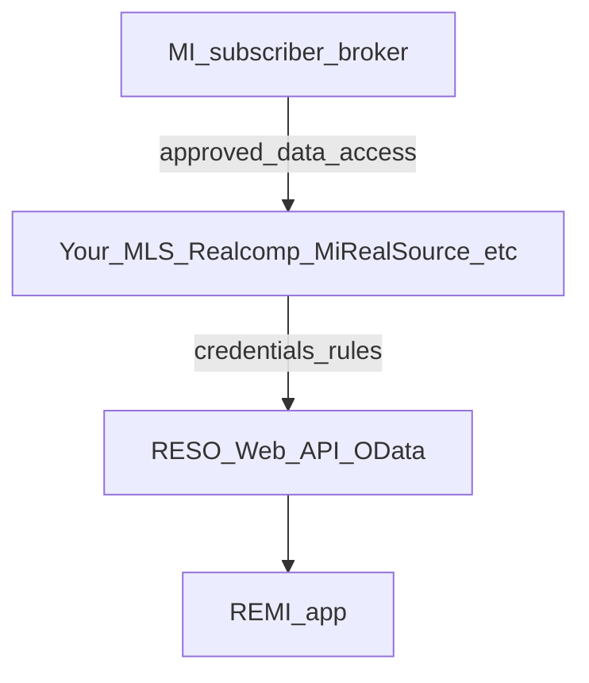
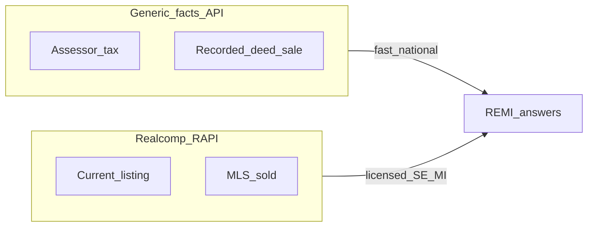

# Real estate data sources — options and research (archive)

This document preserves **options, vendor comparisons, and MLS/Realcomp discussion** for REMI. **Execution** for v1 is documented in [.cursor/plans/real-estate-data-apis.plan.md](../.cursor/plans/real-estate-data-apis.plan.md) (Option B, **RealEstateAPI** only). For **v1 key scope and which endpoint the backend calls**, see [real-estateapi-v1.md](real-estateapi-v1.md).

---

## Problem statement

REMI benefits from **programmatic property context**: market-style questions, “comps,” and per-address facts—for example, *“What did 410 Elm St. sell for the last time it was sold?”*

Important constraints in the market:

- **Zillow** and **Realtor.com** are not self-serve public APIs for arbitrary per-address use in a third-party app. Official Zillow data often routes through **Bridge Interactive**-style **partner/enterprise** programs, not a generic key.
- **MLS** (e.g. **Realcomp** in Southeast Michigan) exposes **licensed, purpose-scoped** data via **RESO Web API**-style feeds (**RAPI**), not an open “internet” API. Access is through **IDX / VOW / back-office** agreements, **in writing**—typically **not** one API key per agent, and **not** unlimited public redistribution.
- A practical **v1** path is **public-records / aggregated “property facts”** (assessor, deed/sale history, tax, AVMs) from a vendor like **RealEstateAPI** or **ATTOM**, with clear semantics (recorder “last sale” vs MLS “last close” may differ).

---

## Zillow

- The legacy **public Zillow API** is not a practical path for new products.
- **Bridge Interactive** ([bridgeinteractive.com](https://www.bridgeinteractive.com/developers/), [bridgedataoutput.com](https://bridgedataoutput.com)) is the official channel for **approved** Zillow Group / RESO **MLS and Zillow datasets** in many setups. Access is **application-based**, with **compliance** (attribution, display, often **no casual redistribution** of certain data—verify current terms).
- **Zillow / macro research** CSVs are separate from per-address Q&A.

## Realtor.com

- There is **no** general-purpose public API for arbitrary address lookups like a typical SaaS key.
- **Anywhere (Realogy) developer** programs ([developer.realogy.com](https://developer.realogy.com/explore-our-apis)) are **enterprise listing/marketing** oriented, not a drop-in “last sale at 410 Elm” API.
- [Realtor.com research data](https://www.realtor.com/research/data/) is **aggregated** market metrics, not per-address sale APIs.

## Answering “What did 410 Elm St. sell for last time?”

- **MLS path:** solds / listing history where your license and MLS rules allow—fields vary.
- **Public records path:** county recorder / tax data via **aggregators** (ATTOM, CoreLogic, Estated, etc.) or API-first vendors—**vendor contracts and county coverage** matter.

---

## Michigan MLS — do they have an API?

**Yes, in the sense the industry means “API” today:** most subscriber-facing MLSs deliver data via a **RESO Web API** (OData) or a certified equivalent, **not** an open public internet API.

**Important:** Michigan is **not** one MLS. Coverage is split across organizations (e.g. **Realcomp**, **MiRealSource**, and other regional boards). The **base URL, vendor (direct vs hosted), and rules** depend on **which MLS** you belong to.

### Realcomp (common in Southeast Michigan)

- **RAPI** — Realcomp’s **RESO Web API** (OData, RESO Data Dictionary, certified), replacing **RETS** for many consumers.
- **Access:** through **approved IDX / VOW / back-office** use, **in writing**; data compliance often via **[IDXSupport@realcomp.com](mailto:IDXSupport@realcomp.com)** (per Realcomp’s published API / IDX pages).
- **Product docs:** [Realcomp — Application Programming Interface (API)](https://www.realcomp.com/Products-Services/Services-Products/Application-Programming-Interface-API) and RAPI announcement materials on [realcomp.moveinmichigan.com](https://realcomp.moveinmichigan.com).

#### Realcomp RAPI — what it is (for engineers)

- **Name:** **RAPI** = **Realcomp API** — Realcomp’s implementation of a modern listing feed, announced as their path **beyond RETS** for **IDX, VOW, and back-office** consumers.
- **Standards:** **RESO Web API** (industry spec: [RESO Web API](https://www.reso.org/reso-web-api/)) with **OData** over HTTPS. Realcomp states **RESO Data Dictionary 1.7** alignment and **Web API Server Core 2.0.0**–level certification in their RAPI announcement ([February 2024 feature](https://www.realcomp.com/News-Events/Feature-2024/February-2024/Realcomp-Website-Updates-for-RAPI)).
- **What you get conceptually:** **Resources** you would expect in RESO (e.g. `Property`, `Member`, `Office`, `Media` — exact names in **OData $metadata** for their server). You query with **OData** patterns (`$filter`, `$select`, `$top`, `$skip`, etc.) instead of older RETS query strings.
- **Auth:** Realcomp describes **OAuth 2.0** for RAPI. **Token endpoints, client IDs, and base URLs** are **not** generic—**Realcomp issues them** after your **approved** data relationship. Use the package they give you and [IDXSupport@realcomp.com](mailto:IDXSupport@realcomp.com) for setup questions.
- **Not a public “Zillow alternative”:** RAPI is for **licensed** MLS use per your agreement. **Rate limits, replication vs live query, and which statuses** (active, pending, sold, off-market) you may show are **policy** questions.

#### REMI + RAPI: who gets API keys? (feasibility — not legal advice)

- Raw IDX data goes through the **Realcomp IDX Contract** and **IDX Rules**; the **“IDX Consultant”** is the person/company who **downloads and programs** the feed. [Internet Data Exchange overview](https://www.realcomp.moveinmichigan.com/Products-Services/Services-Products/Internet-Data-Exchange-IDX-for-Realcomp-Customers): **only the IDX Consultant** is given account credentials for the raw API for compliant IDX, in the usual model—not “1,000 agents each with a personal RAPI key.”
- **REMI as vendor:** **Server-side** credentials, broker + MLS rules, **B2B2B** (REMI ↔ broker ↔ Realcomp) for multi-broker products—not consumer BYOK of MLS keys.

**“So I get the API key and everyone queries with my key?”**

- **Architecture:** End users should **not** hold the RAPI **secret**; **REMI’s server** obtains tokens and calls RAPI.
- **Policy:** The **agreement** defines what you may show, to whom, with what attribution/refresh—**not** an unlimited pipe to everyone on the internet.

**Concern: MLS will block “anyone using my app”**

- MLS data is **purpose-scoped** (IDX, VOW, subscriber tools, back office, etc.). An **unbounded** public “full MLS” app is a hard case; **professional / participant** tools and **per-broker** vendor relationships are the common patterns.

### MiRealSource and other MLSs

- Many Michigan MLSs use a **RESO Web API** **directly** or via a **platform** (e.g. **Bridge** hosts RESO for some MLSs). **Get connection details from your MLS** after membership approval.

### NAR / RESO expectation

- **RESO** ([reso.org](https://www.reso.org/)) defines **standards**; **credentials** come from each **MLS** under **subscriber/IDX** agreements.

### Practical takeaway (MLS path)

If you have **Michigan MLS** access, the **highest-signal** path for **live** listing/sold data is the **documented** MLS Web API (e.g. **Realcomp RAPI**) under a proper **license**, paired with public records for gaps as allowed.

---

## Product scope: options A / B / C (historical)

**A — Realcomp / SE Michigan first:** Richest for **practitioners** in-market; heaviest **compliance** and geography scope.

**B — Non-MLS “fast facts” API (national public-records / aggregates):** Fast to ship; **not** the MLS layer; “last sale” is often **recorder** semantics. **REMI v1 uses this** via **RealEstateAPI**.

**C — Hybrid:** Public facts in v1; add **RAPI** later for **licensed** MLS when ready; always **label** sources in the product.

| Path                                                    | Examples (verify current docs and pricing)                                                                                                                                 | Notes |
| ------------------------------------------------------- | -------------------------------------------------------------------------------------------------------------------------------------------------------------------------- | ----- |
| **Assessor + deed + AVM**                               | [ATTOM developer platform](https://api.developer.attomdata.com/home) / [attomdata.com](https://www.attomdata.com/solutions/property-data-api/)                             | Broad U.S. coverage. Estated → ATTOM. |
| **API-first property**                                 | [RealEstateAPI](https://developer.realestateapi.com/)                                                                                                                       | Property detail, **sale history**, **comps**; `transactionType` and non-disclosure caveats in docs. |
| **Listings on API marketplaces**                        | [RapidAPI](https://rapidapi.com/) etc.                                                                                                                                    | Vet data owner and ToS. |
| **Enterprise**                                          | CoreLogic / Trestle (often **MLS**-oriented)                                                                                                                               | Not the same as one national public-record key. |

**Michigan check:** validate **warranty sale** vs **$0 transfer** in API responses.

### ATTOM vs RealEstateAPI (comparison; v1: REAPI)

| Dimension        | **ATTOM** | **RealEstateAPI (REAPI)** |
| ---------------- | ---------- | ------------------------- |
| Positioning      | Large national warehouse | Developer docs; `saleHistory` / comps objects |
| Typical try/buy  | Trial / contact / startup tiers | Free tier or low entry varies—verify on site |
| “MLS”            | Not a drop-in for Realcomp | Add-on MLS marketing = separate compliance |

**v1 choice:** **RealEstateAPI** (low setup friction; key obtained). **ATTOM** not selected for now. Optional: spot-check **SE Michigan** addresses in production for match quality.

### Option C (hybrid) diagram

**Heuristic:** Agent-grade *in one MLS* → bias A or C with MLS. **Any U.S. address, light context** → B until a broker/MLS feed exists.

---

## When you add Realcomp RAPI (checklist, future)

- **mls-creds:** With your broker, request **IDX / VOW / back-office** access; clarify whether **REMI** is the **IDX vendor** (server-side creds) vs per-agent. Email [IDXSupport@realcomp.com](mailto:IDXSupport@realcomp.com) with a short **product** summary.
- **rapi-access-model:** Ask how **multi-tenant** apps may hold credentials and display data (not legal advice; confirm in writing).

---

## Open reference links

- [RealEstateAPI — developer docs](https://developer.realestateapi.com/)
- [Realcomp — API / IDX](https://www.realcomp.com/Products-Services/Services-Products/Application-Programming-Interface-API)
- [RESO Web API](https://www.reso.org/reso-web-api/)
